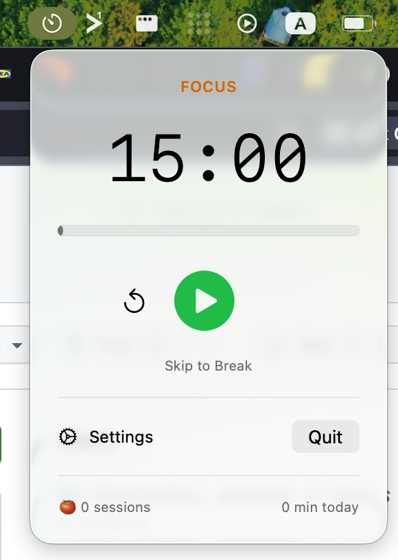

# Sprout Pomodoro

A minimal macOS menu bar Pomodoro timer with focus and break cycles.

The app lives entirely in the menu bar — no Dock icon, no app window. Click the timer in the menu bar to start, pause, or reset your session.



## Download

[Download latest release](https://github.com/andrewchaa/sprout-pomodoro/releases/latest)

## Features

- Focus and break timers that automatically switch when a session ends
- Configurable focus duration (5–60 minutes, default 20)
- Configurable break duration (5–60 minutes, default 5)
- System notifications with sound when each session completes
- Skip to break or skip break without waiting for the timer
- Settings accessible via the gear icon or `Cmd+,`

## Requirements

- macOS 26.2 (Tahoe) or later
- Xcode 26.2 or later
- An Apple ID signed into Xcode (no paid developer account needed — Xcode creates a free Personal Team automatically)

## Running locally

1. Clone the repository:

   ```bash
   git clone https://github.com/andrewchaa/sprout-pomodoro.git
   cd sprout-pomodoro
   ```

2. Open the project in Xcode:

   ```bash
   open sprout-pomodoro.xcodeproj
   ```

3. Set your signing team:
   - In the Project navigator, select the `sprout-pomodoro` project
   - Select the `sprout-pomodoro` target
   - Go to **Signing & Capabilities**
   - Under **Team**, select your Apple Developer account

   Repeat for the `sprout-pomodoroTests` and `sprout-pomodoroUITests` targets.

4. Build and run with `Cmd+R`. The app will appear in your menu bar.

## Running tests

Run the test suite with `Cmd+U` in Xcode, or via the command line:

```bash
xcodebuild test \
  -project sprout-pomodoro.xcodeproj \
  -scheme sprout-pomodoro \
  -destination 'platform=macOS'
```

## Project structure

```
sprout-pomodoro/
  sprout_pomodoroApp.swift   # App entry point, MenuBarExtra scene
  TimerViewModel.swift       # Timer state and countdown logic
  MenuBarView.swift          # Popover UI shown on menu bar click
  TimerMenuBarLabel.swift    # The label rendered in the menu bar
  NotificationManager.swift  # System notification handling
  SettingsView.swift         # Settings window (focus/break duration)
sprout-pomodoroTests/
  sprout_pomodoroTests.swift # Unit tests for TimerViewModel
```
